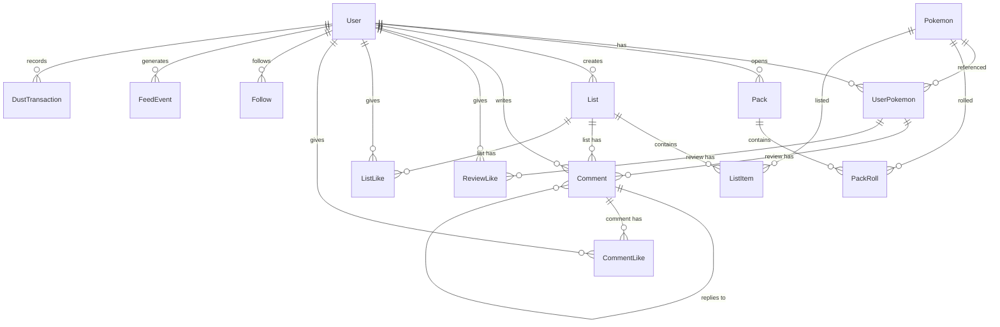
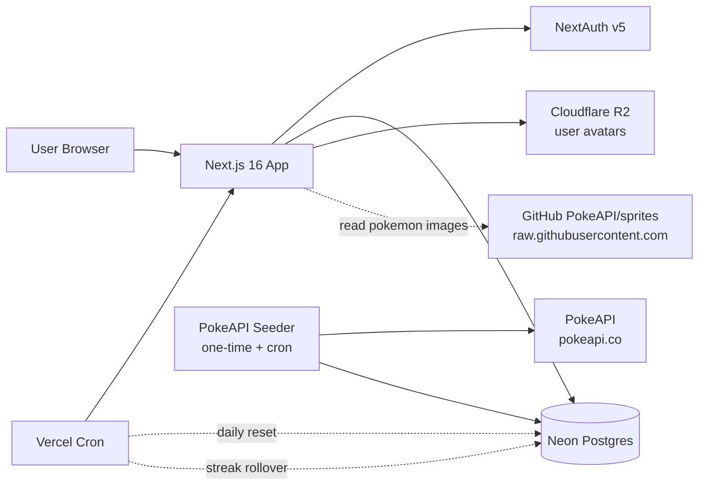

# PokeHub — Project Overview

> **Status:** Planning / pre-MVP
> **Name:** PokeHub
> **Author:** Damian
> **Last updated:** 2026-04-27

---

## 1. Problem statement

Pokémon has one of the strongest fan communities on the internet — but the social experience around it is fragmented:

- **Smogon / Reddit / Discord** — text-heavy, forum-style, high barrier to entry, dated UX.
- **Pokémon HOME / official apps** — collection-only, zero social layer, walled garden.
- **Pokémon TCG Live** — collection + battle, but card-game scope only.
- **Twitter / Instagram / TikTok** — generic platforms; Pokémon content gets buried in algorithmic noise.

There is no equivalent of **Letterboxd-for-Pokémon**: a clean, modern, opinion-first social platform where fans can rate, review, list, and discuss the ~1300 species of the franchise — and where their personal "trainer identity" travels with them across the platform.

PokeHub is that platform, with one twist: a **passive collection layer** (daily packs) overlaid on top of the opinion layer, giving users a daily-return hook without gating any of the core social functionality behind a grind.

### Core thesis

> The opinion layer is **democratic** — every user can rate, review, list, and follow from the first minute.
> The collection layer is **earned** — it's a parallel achievement system that decorates your profile but never gates your voice.

---

## 2. Target users

| Persona           | Description                                                                   | Primary use case                                                                                          |
| ----------------- | ----------------------------------------------------------------------------- | --------------------------------------------------------------------------------------------------------- |
| **The Ranker**    | Has strong opinions about Pokémon since Gen 1. Wants a place to publish them. | Writes reviews, builds top-N lists, follows critics with similar taste.                                   |
| **The Collector** | Loves collection mechanics (TCG, Pokémon HOME, ShinyHunting).                 | Opens daily packs, builds out their Pokédex, trades duplicates (v2).                                      |
| **The Lurker**    | Doesn't post much but loves browsing.                                         | Reads lists, follows favorite creators, lurks the discovery feed.                                         |
| **The Returnee**  | Played Gen 1–3 as a kid, wants nostalgia without re-installing emulators.     | Builds nostalgic teams, rates their childhood favorites, discovers new generations through the community. |

---

## 3. Core mechanics

PokeHub has **two independent axes** of user activity. They share a profile and a data model, but neither gates the other.

### Axis 1 — Opinions (Letterboxd layer)

Available to every user on signup, for every Pokémon, with no unlocks required.

- **Rate** any Pokémon 1–5 stars
- **Review** with optional long-form text
- **Favorite** (heart) any Pokémon — unlimited
- **Wishlist** up to 3 Pokémon (also influences pack drops; see §4.5)
- **Lists** — create ranked or unranked lists ("My Top 10 Water Types", "Underrated Gen 5", "Nostalgic Team")
- **Follow** other users
- **Comment** on reviews and lists
- **Like** reviews, lists, and comments
- **Signature team** — pin 6 Pokémon to your profile as identity expression

### Axis 2 — Collection (Pack layer)

Parallel system that records what a user has "caught" via packs. Cosmetic / progression only.

- **Daily free pack** — 1 per 24 hours, contains 3 Pokémon weighted by rarity
- **Earned packs** — earned via platform activity (caps at 5/day to prevent abuse)
- **Caught flag per Pokémon** — `isCaught: boolean` (set when first pulled from a pack)
- **Duplicates count** — pulling Pikachu twice gives you `Pikachu ×2`
- **Shiny variants** — ~0.5% per slot, independent of tier
- **Dust currency** — duplicates can be dissolved into "dust" (10 per duplicate); 100 dust = bonus pack
- **Pity system** — guaranteed rare after 20 packs without one; guaranteed mythical after 50

### Why two axes (and not one)?

| Single-axis design            | Why it fails                                                                                              |
| ----------------------------- | --------------------------------------------------------------------------------------------------------- |
| Pure opinion (no packs)       | Weak daily-return hook. No reason to come back tomorrow if you've already rated your favorites.           |
| Pure collection (no opinions) | Voices gated by grind. Newcomers can't participate. Becomes Pokémon TCG Live with comments.               |
| Coupled (must catch to rate)  | Worst of both. Lists capped to RNG. Childhood favorites you never roll. Frustration.                      |
| **Decoupled (PokeHub)**       | **Opinions are democratic from minute one. Collection adds a parallel reward loop and a richer profile.** |

---

## 4. Pack mechanics (detailed)

The pack system is the daily-return engine. Every parameter below is tunable post-launch via env/config.

### 4.1 Pack size & rarity tiers

Each pack contains **3 Pokémon**, each rolled independently against the rarity table:

| Tier         | Weight | Source criterion (PokeAPI)                                     |
| ------------ | ------ | -------------------------------------------------------------- |
| `COMMON`     | 70%    | Default                                                        |
| `UNCOMMON`   | 20%    | Pseudo-legendaries, starters, fan favorites (curated tag list) |
| `RARE`       | 9%     | `is_legendary === true` on `pokemon-species`                   |
| `ULTRA_RARE` | 1%     | `is_mythical === true` on `pokemon-species`                    |

**Shiny:** independent ~0.5% roll per slot, applied after tier resolution. A shiny Magikarp is a celebrated outcome.

### 4.2 Pack sources

| Source                    | Rate                          | Cooldown             |
| ------------------------- | ----------------------------- | -------------------- |
| `DAILY_FREE`              | 1 / day                       | 24h since last claim |
| `ACTIVITY_REVIEW`         | 1 per first review of the day | Daily reset          |
| `ACTIVITY_LIST`           | 1 per list created            | 1 / day              |
| `ACTIVITY_LIKES_RECEIVED` | 1 per 5 likes earned          | Cap: 1 / day         |
| `STREAK_BONUS`            | 1 every 7-day streak          | At streak rollover   |
| `DUST_PURCHASE`           | 1 per 100 dust                | No cooldown          |

**Hard cap:** 5 earned packs per user per day (excluding daily free + dust purchases). Prevents spam-content gaming the system.

### 4.3 Pity counters

Stored on `User`:

- `packsSinceLastRare` — increments per pack opened. On RARE+ pull, resets. At 20, next pack guarantees a RARE-tier slot.
- `packsSinceLastUltraRare` — same, threshold 50, guarantees ULTRA_RARE.

Pity is per-user and persists across sessions.

### 4.4 Duplicates & dust

- Duplicate of a Pokémon you already have → `count` increments on `UserPokemon`.
- User can manually dissolve duplicates: `dissolve(pokemonId)` → +10 dust, `count -= 1`.
- 100 dust → buy 1 pack of type `DUST_PURCHASE` (counts toward earned pack cap).
- Shiny duplicates: separate counter (`shinyCount`), worth 100 dust each on dissolve.

### 4.5 Wishlist boost (soft targeting)

Users select up to 3 wishlist Pokémon. Each wishlisted Pokémon gets ×1.5 weight in _their_ pack rolls (only their own packs — not a global change).

This solves "I never get my childhood favorite" without breaking the random feel.

### 4.6 Social feedback on rare pulls

When a roll comes out RARE, ULTRA_RARE, or SHINY, a `FeedEvent` is created that surfaces to followers. Common pulls don't spam the feed.

Example feed entries:

- "Damian pulled a **shiny Charizard**!" 🔥
- "Anna got **Mew** — her first mythical!"

Reactions and comments allowed on these events.

---

## 5. Data model

### 5.1 ERD



### 5.2 Architecture



### 5.3 Prisma schema (Prisma 7, TypeScript-based query compiler)

```prisma
generator client {
  provider = "prisma-client"
  output   = "../src/generated/prisma"
}

datasource db {
  provider = "postgresql"
  url      = env("DATABASE_URL")
}

// =========================================================
// NextAuth
// =========================================================

model Account {
  id                String  @id @default(cuid())
  userId            String
  type              String
  provider          String
  providerAccountId String
  refresh_token     String? @db.Text
  access_token      String? @db.Text
  expires_at        Int?
  token_type        String?
  scope             String?
  id_token          String? @db.Text
  session_state     String?

  user User @relation(fields: [userId], references: [id], onDelete: Cascade)

  @@unique([provider, providerAccountId])
}

model Session {
  id           String   @id @default(cuid())
  sessionToken String   @unique
  userId       String
  expires      DateTime
  user         User     @relation(fields: [userId], references: [id], onDelete: Cascade)
}

model VerificationToken {
  identifier String
  token      String   @unique
  expires    DateTime

  @@unique([identifier, token])
}

// =========================================================
// User
// =========================================================

model User {
  id            String    @id @default(cuid())
  email         String    @unique
  emailVerified DateTime?
  name          String?
  username      String?   @unique
  image         String?
  bio           String?

  // Currency & progression
  dust                    Int @default(0)
  packsSinceLastRare      Int @default(0)
  packsSinceLastUltraRare Int @default(0)

  // Streaks
  currentStreak Int       @default(0)
  longestStreak Int       @default(0)
  lastDailyAt   DateTime?

  // Signature team — array of pokemonIds, max length 6 enforced in app
  signatureTeam Int[] @default([])

  // Subscription (cosmetic-only Pro)
  isPro Boolean @default(false)

  // Relations
  accounts         Account[]
  sessions         Session[]
  pokemons         UserPokemon[]
  packs            Pack[]
  lists            List[]
  comments         Comment[]
  reviewLikes      ReviewLike[]
  listLikes        ListLike[]
  commentLikes     CommentLike[]
  followers        Follow[]          @relation("Following")
  following        Follow[]          @relation("Followers")
  feedEvents       FeedEvent[]
  dustTransactions DustTransaction[]

  createdAt DateTime @default(now())
  updatedAt DateTime @updatedAt

  @@index([createdAt])
}

// =========================================================
// Pokemon (seeded from PokeAPI, ~1300 rows)
// =========================================================

enum Rarity {
  COMMON
  UNCOMMON
  RARE
  ULTRA_RARE
}

model Pokemon {
  id          Int    @id // pokedex number
  slug        String @unique
  name        String
  types       String[]
  generation  Int
  isLegendary Boolean @default(false)
  isMythical  Boolean @default(false)
  rarity      Rarity

  // Images (all hosted on raw.githubusercontent.com/PokeAPI/sprites)
  artworkUrl      String  // official-artwork
  spriteUrl       String  // small sprite
  shinyArtworkUrl String?

  // Stats
  height    Int  // decimeters
  weight    Int  // hectograms
  baseStats Json // { hp, attack, defense, spAttack, spDefense, speed }

  flavorText String?

  userPokemons UserPokemon[]
  packRolls    PackRoll[]
  listItems    ListItem[]

  createdAt DateTime @default(now())
  updatedAt DateTime @updatedAt

  @@index([rarity])
  @@index([generation])
  @@index([slug])
  @@index([isLegendary])
  @@index([isMythical])
}

// =========================================================
// UserPokemon — central per-user-per-pokemon state
// Holds collection status + review (one row per pair)
// =========================================================

model UserPokemon {
  id        String @id @default(cuid())
  userId    String
  pokemonId Int

  // Collection
  isCaught      Boolean   @default(false)
  count         Int       @default(0)
  shinyCount    Int       @default(0)
  firstCaughtAt DateTime?

  // Personal flags
  isFavorite Boolean @default(false)
  isWishlist Boolean @default(false)

  // Review (rating + optional text)
  rating     Int?      // 1-5, validated app-side
  reviewText String?
  reviewedAt DateTime?

  user        User         @relation(fields: [userId], references: [id], onDelete: Cascade)
  pokemon     Pokemon      @relation(fields: [pokemonId], references: [id])
  comments    Comment[]    @relation("CommentsOnReview")
  reviewLikes ReviewLike[]

  createdAt DateTime @default(now())
  updatedAt DateTime @updatedAt

  @@unique([userId, pokemonId])
  @@index([userId, isCaught])
  @@index([userId, isFavorite])
  @@index([userId, isWishlist])
  @@index([pokemonId, rating])      // for aggregating community ratings
  @@index([reviewedAt])              // for global review feed
}

// =========================================================
// Packs
// =========================================================

enum PackType {
  DAILY
  EARNED
  PREMIUM
  EVENT
}

enum PackSource {
  DAILY_FREE
  ACTIVITY_REVIEW
  ACTIVITY_LIST
  ACTIVITY_LIKES_RECEIVED
  STREAK_BONUS
  DUST_PURCHASE
  EVENT
}

model Pack {
  id       String     @id @default(cuid())
  userId   String
  type     PackType   @default(DAILY)
  source   PackSource
  openedAt DateTime   @default(now())

  user  User       @relation(fields: [userId], references: [id], onDelete: Cascade)
  rolls PackRoll[]

  @@index([userId, openedAt])
  @@index([source, openedAt])
}

model PackRoll {
  id        String  @id @default(cuid())
  packId    String
  pokemonId Int
  position  Int     // 1, 2, or 3
  isShiny   Boolean @default(false)
  rarity    Rarity  // snapshot at roll time

  pack    Pack    @relation(fields: [packId], references: [id], onDelete: Cascade)
  pokemon Pokemon @relation(fields: [pokemonId], references: [id])

  @@unique([packId, position])
  @@index([packId])
}

// =========================================================
// Lists
// =========================================================

model List {
  id          String  @id @default(cuid())
  userId      String
  title       String
  slug        String
  description String?
  isPublic    Boolean @default(true)
  isRanked    Boolean @default(true)

  user      User       @relation(fields: [userId], references: [id], onDelete: Cascade)
  items     ListItem[]
  comments  Comment[]  @relation("CommentsOnList")
  listLikes ListLike[]

  createdAt DateTime @default(now())
  updatedAt DateTime @updatedAt

  @@unique([userId, slug])
  @@index([userId, createdAt])
  @@index([isPublic, createdAt]) // public discovery feed
}

model ListItem {
  id        String  @id @default(cuid())
  listId    String
  pokemonId Int
  position  Int
  note      String?

  list    List    @relation(fields: [listId], references: [id], onDelete: Cascade)
  pokemon Pokemon @relation(fields: [pokemonId], references: [id])

  @@unique([listId, pokemonId])
  @@unique([listId, position])
  @@index([listId])
}

// =========================================================
// Comments (polymorphic via two nullable FKs)
// CHECK constraint via migration: exactly one of (reviewId, listId) must be set
// =========================================================

model Comment {
  id   String @id @default(cuid())
  userId String
  body String

  // Polymorphic target
  reviewId String? // -> UserPokemon.id
  listId   String? // -> List.id
  parentId String? // for threaded replies

  user     User         @relation(fields: [userId], references: [id], onDelete: Cascade)
  review   UserPokemon? @relation("CommentsOnReview", fields: [reviewId], references: [id], onDelete: Cascade)
  list     List?        @relation("CommentsOnList", fields: [listId], references: [id], onDelete: Cascade)
  parent   Comment?     @relation("CommentReplies", fields: [parentId], references: [id], onDelete: Cascade)
  replies  Comment[]    @relation("CommentReplies")
  likes    CommentLike[]

  createdAt DateTime @default(now())
  updatedAt DateTime @updatedAt

  @@index([reviewId, createdAt])
  @@index([listId, createdAt])
  @@index([parentId])
  @@index([userId, createdAt])
}

// =========================================================
// Likes (separate tables — cleaner than polymorphic in Postgres)
// =========================================================

model ReviewLike {
  userId    String
  reviewId  String
  createdAt DateTime @default(now())

  user   User        @relation(fields: [userId], references: [id], onDelete: Cascade)
  review UserPokemon @relation(fields: [reviewId], references: [id], onDelete: Cascade)

  @@id([userId, reviewId])
  @@index([reviewId])
}

model ListLike {
  userId    String
  listId    String
  createdAt DateTime @default(now())

  user User @relation(fields: [userId], references: [id], onDelete: Cascade)
  list List @relation(fields: [listId], references: [id], onDelete: Cascade)

  @@id([userId, listId])
  @@index([listId])
}

model CommentLike {
  userId    String
  commentId String
  createdAt DateTime @default(now())

  user    User    @relation(fields: [userId], references: [id], onDelete: Cascade)
  comment Comment @relation(fields: [commentId], references: [id], onDelete: Cascade)

  @@id([userId, commentId])
  @@index([commentId])
}

// =========================================================
// Follow graph
// =========================================================

model Follow {
  followerId  String
  followingId String
  createdAt   DateTime @default(now())

  follower  User @relation("Followers", fields: [followerId], references: [id], onDelete: Cascade)
  following User @relation("Following", fields: [followingId], references: [id], onDelete: Cascade)

  @@id([followerId, followingId])
  @@index([followerId])
  @@index([followingId])
}

// =========================================================
// Feed events (activity stream)
// =========================================================

enum FeedEventType {
  REVIEW_CREATED
  LIST_CREATED
  RARE_PULL
  ULTRA_RARE_PULL
  SHINY_PULL
  POKEMON_FAVORITED
  STREAK_MILESTONE
  USER_FOLLOWED
}

model FeedEvent {
  id       String        @id @default(cuid())
  userId   String
  type     FeedEventType
  metadata Json          // flexible payload — pokemonId, listId, packRollId, etc.

  user User @relation(fields: [userId], references: [id], onDelete: Cascade)

  createdAt DateTime @default(now())

  @@index([userId, createdAt])
  @@index([type, createdAt])
}

// =========================================================
// Dust ledger (audit trail of currency)
// =========================================================

enum DustReason {
  DUPLICATE_DISSOLVED
  SHINY_DISSOLVED
  PACK_PURCHASED
  EVENT_REWARD
  STREAK_BONUS
}

model DustTransaction {
  id          String     @id @default(cuid())
  userId      String
  amount      Int        // positive = earned, negative = spent
  reason      DustReason
  referenceId String?    // pokemonId, packId, etc.

  user User @relation(fields: [userId], references: [id], onDelete: Cascade)

  createdAt DateTime @default(now())

  @@index([userId, createdAt])
}
```

### 5.4 Schema notes & decisions

| Decision                                                 | Rationale                                                                                                                                      |
| -------------------------------------------------------- | ---------------------------------------------------------------------------------------------------------------------------------------------- |
| `UserPokemon` holds **both** collection state and review | Avoids two tables for what is logically "user's relationship to this Pokémon". One join, simpler queries.                                      |
| Three separate `*Like` tables vs polymorphic             | Postgres `NULL != NULL` breaks unique constraints on polymorphic likes. Three tables = proper composite keys, no application-side enforcement. |
| `Pokemon.id` is `Int` (pokedex number)                   | Stable, externally meaningful, debugging-friendly. Pokédex numbers don't change.                                                               |
| `Comment` uses polymorphic two-nullable-FK               | Comments need a single table for unified queries (user's all comments). CHECK constraint added via migration.                                  |
| `signatureTeam` as `Int[]` rather than join table        | Always exactly 0–6 items, no metadata per slot, ordered. Array is the right primitive.                                                         |
| `DustTransaction` as ledger                              | Source of truth for user's dust; balance = `SUM(amount)`. Audit trail for free, easy to debug "where did my dust go?".                         |
| `FeedEvent.metadata` as `Json`                           | Flexibility for varied event types without schema migrations per new event. Trade-off: less type safety; document shapes in a TS union.        |
| Rarity stored on both `Pokemon` and `PackRoll`           | Snapshot pattern: if rarity tiers are rebalanced, historical pulls preserve the rarity they were when rolled.                                  |

---

## 6. Routing conventions

```
/                          Landing (logged out) | Feed (logged in)
/login                     OAuth providers
/signup                    Username selection step

/u/[username]              User profile (signature team, stats, recent activity)
/u/[username]/collection   Collection grid (caught / missing)
/u/[username]/reviews      All reviews
/u/[username]/lists        All public lists
/u/[username]/followers
/u/[username]/following

/p/[slug]                  Pokémon detail (community ratings, top reviews, lists featuring it)
/p/[slug]/reviews          All reviews of this Pokémon

/list/[id]                 List detail with comments
/list/new                  Create list
/list/[id]/edit

/review/[id]               Single review view (deep-link from feed/notifications)

/packs                     Pack opening — daily + earned + dust shop
/packs/history             Past pack contents

/discover                  Trending lists, top reviewers, popular Pokémon
/search                    Unified search (users, Pokémon, lists)

/settings                  Profile, account, notifications
/settings/wishlist         Manage 3 wishlist slots
/settings/signature-team   Configure pinned 6
/settings/billing          Pro subscription (cosmetic-only)

/api/auth/*                NextAuth
/api/packs/open            POST — open a pack
/api/packs/dissolve        POST — dissolve duplicates → dust
/api/pokemon/[id]/rate     PUT — set rating + review
/api/pokemon/[id]/status   PUT — set favorite/wishlist
/api/lists                 GET (own), POST
/api/lists/[id]            GET, PUT, DELETE
/api/lists/[id]/items      POST, PUT (reorder), DELETE
/api/comments              POST
/api/comments/[id]         DELETE
/api/likes/review          POST, DELETE
/api/likes/list            POST, DELETE
/api/likes/comment         POST, DELETE
/api/follows               POST, DELETE
/api/feed                  GET — paginated personal feed
/api/discover/trending     GET — public discovery
```

---

## 7. Tech stack

Mirrors DevStash where possible (familiarity, monorepo potential):

| Layer        | Choice                             | Notes                                                         |
| ------------ | ---------------------------------- | ------------------------------------------------------------- |
| Framework    | Next.js 16 (App Router)            | RSC for static Pokémon pages, route handlers for mutations    |
| UI           | React 19 + Tailwind v4 + shadcn/ui | Same design system                                            |
| ORM          | Prisma 7 (Rust-free client)        | TypeScript query compiler, smaller bundle, edge-friendly      |
| DB           | Neon Postgres                      | Branching for preview deploys                                 |
| Auth         | NextAuth v5                        | OAuth (Google, GitHub) + email magic link                     |
| File storage | Cloudflare R2                      | User avatars only (Pokémon images via PokeAPI sprites GitHub) |
| Payments     | Stripe                             | Pro subscription (cosmetic-only)                              |
| Cron         | Vercel Cron                        | Daily reset, streak rollover, weekly digest                   |
| Hosting      | Vercel                             | Edge-friendly with Prisma 7                                   |
| External     | PokeAPI                            | One-time seed + monthly sync                                  |

---

## 8. Pokémon data strategy

PokeAPI is a free public API serving ~50B requests/month. We don't hit it at runtime.

### 8.1 Seeding

A standalone script (`scripts/seed-pokemon.ts`) runs once at project setup and on demand thereafter:

1. Fetch `/api/v2/pokemon-species?limit=10000` → list of all species
2. For each: fetch `/pokemon/{id}` and `/pokemon-species/{id}`
3. Map to `Pokemon` rows; compute `rarity` from `is_legendary` / `is_mythical` + curated uncommon list
4. Image URLs point to `https://raw.githubusercontent.com/PokeAPI/sprites/master/...` — no proxying
5. Insert via `prisma.pokemon.createMany({ skipDuplicates: true })`

Re-runnable safely (idempotent).

### 8.2 Why GitHub sprites and not R2?

- PokeAPI explicitly hosts these for public use
- No bandwidth cost on us
- No copyright proxy concern (we link, we don't host)
- Next.js Image component can still optimize them via `remotePatterns`

If the GitHub repo ever changes its URL structure, we re-run the seeder. Cheap insurance.

---

## 9. Free vs Pro

**Pro is cosmetic-only.** No pay-to-win, no gated content, no faster pity, no better odds.

| Feature                    | Free          | Pro                                    |
| -------------------------- | ------------- | -------------------------------------- |
| Daily pack                 | ✅            | ✅                                     |
| Earnable packs (cap 5/day) | ✅            | ✅                                     |
| Pack odds                  | Standard      | **Standard (no change)**               |
| Reviews & ratings          | Unlimited     | Unlimited                              |
| Lists                      | 20 max        | Unlimited                              |
| Wishlist slots             | 3             | 5                                      |
| Signature team             | 6 fixed slots | 6 with custom backgrounds              |
| Profile customization      | Default theme | Custom themes, animated avatars        |
| Pack opening animation     | Standard      | Premium animations + sound             |
| Profile badges             | Earned only   | Earned + Pro-exclusive cosmetic badges |
| Ad-free                    | ✅ (always)   | ✅                                     |
| Pricing                    | $0            | $3.99/mo or $29.99/year                |

**Why this matters:** the moment Pro affects packs or content, the trust contract breaks. Letterboxd Pro is cosmetic + stats; we follow that model.

---

## 10. Development notes

### 10.1 Migration strategy

- Initial migration ships full schema (no incremental dev migrations in commit history)
- Future migrations: feature-flagged, deployed before code that uses them
- Rollback plan documented per migration in `prisma/migrations/README.md`

### 10.2 `DEV_UNLOCK_ALL` feature flag pattern

Same as DevStash. Set `DEV_UNLOCK_ALL=true` in `.env.local` to:

- Bypass daily pack cooldown (open infinite packs)
- Bypass earned pack daily cap
- Unlock all Pro features
- Bypass NextAuth (auto-login as test user)
- Skip Stripe checks

```ts
// src/lib/dev.ts
export const DEV_UNLOCK_ALL =
  process.env.DEV_UNLOCK_ALL === "true" &&
  process.env.NODE_ENV !== "production";

// Usage:
export async function canOpenDailyPack(user: User) {
  if (DEV_UNLOCK_ALL) return true;
  if (!user.lastDailyAt) return true;
  return Date.now() - user.lastDailyAt.getTime() >= 24 * 3600 * 1000;
}
```

Hard-coded production check prevents accidental deploy.

### 10.3 Pack opening flow

```ts
// Pseudocode for /api/packs/open
async function openPack(userId: string, source: PackSource) {
  return prisma.$transaction(async (tx) => {
    // 1. Validate source (cooldowns, caps)
    const user = await tx.user.findUniqueOrThrow({ where: { id: userId } });
    validatePackEligibility(user, source);

    // 2. Roll 3 slots
    const wishlist = await getWishlistedPokemonIds(tx, userId);
    const rolls: PackRoll[] = [];
    let pity = {
      rare: user.packsSinceLastRare,
      ultra: user.packsSinceLastUltraRare,
    };

    for (let i = 0; i < 3; i++) {
      const tier = rollTier({ pity, slotIndex: i });
      const pokemon = rollPokemonInTier(tier, { wishlistBoost: wishlist });
      const isShiny = Math.random() < 0.005;
      rolls.push({
        position: i + 1,
        pokemonId: pokemon.id,
        rarity: tier,
        isShiny,
      });
      pity = updatePity(pity, tier);
    }

    // 3. Persist Pack + PackRolls
    const pack = await tx.pack.create({
      data: {
        userId,
        source,
        type: packTypeFromSource(source),
        rolls: { create: rolls },
      },
    });

    // 4. Update UserPokemon (collection state, counts)
    for (const roll of rolls) {
      await tx.userPokemon.upsert({
        where: { userId_pokemonId: { userId, pokemonId: roll.pokemonId } },
        create: {
          userId,
          pokemonId: roll.pokemonId,
          isCaught: true,
          count: 1,
          shinyCount: roll.isShiny ? 1 : 0,
          firstCaughtAt: new Date(),
        },
        update: {
          isCaught: true,
          count: { increment: 1 },
          shinyCount: roll.isShiny ? { increment: 1 } : undefined,
        },
      });
    }

    // 5. Update user pity counters + lastDailyAt
    await tx.user.update({
      where: { id: userId },
      data: {
        packsSinceLastRare: pity.rare,
        packsSinceLastUltraRare: pity.ultra,
        lastDailyAt: source === "DAILY_FREE" ? new Date() : undefined,
      },
    });

    // 6. Generate FeedEvents for rare/ultra/shiny pulls
    for (const roll of rolls) {
      if (
        roll.isShiny ||
        roll.rarity === "RARE" ||
        roll.rarity === "ULTRA_RARE"
      ) {
        await tx.feedEvent.create({
          data: {
            userId,
            type: roll.isShiny
              ? "SHINY_PULL"
              : roll.rarity === "ULTRA_RARE"
                ? "ULTRA_RARE_PULL"
                : "RARE_PULL",
            metadata: {
              packId: pack.id,
              pokemonId: roll.pokemonId,
              isShiny: roll.isShiny,
            },
          },
        });
      }
    }

    return pack;
  });
}
```

All in one transaction → atomic. If any step fails, no half-opened packs.

### 10.4 Environment variables

```bash
# Database
DATABASE_URL="postgresql://..."

# NextAuth
NEXTAUTH_SECRET="..."
NEXTAUTH_URL="http://localhost:3000"
GITHUB_CLIENT_ID="..."
GITHUB_CLIENT_SECRET="..."
GOOGLE_CLIENT_ID="..."
GOOGLE_CLIENT_SECRET="..."
EMAIL_SERVER_HOST="..."
EMAIL_SERVER_PORT="..."
EMAIL_FROM="..."

# Cloudflare R2 (avatars)
R2_ACCOUNT_ID="..."
R2_ACCESS_KEY_ID="..."
R2_SECRET_ACCESS_KEY="..."
R2_BUCKET="pokehub-avatars"
R2_PUBLIC_URL="..."

# Stripe (Pro)
STRIPE_SECRET_KEY="..."
STRIPE_WEBHOOK_SECRET="..."
STRIPE_PRICE_ID_MONTHLY="..."
STRIPE_PRICE_ID_YEARLY="..."

# Dev overrides
DEV_UNLOCK_ALL="false"
```

### 10.5 Seeding & maintenance

| Job             | Schedule             | Action                            |
| --------------- | -------------------- | --------------------------------- |
| Pokémon seed    | One-time + on-demand | Full PokeAPI sync                 |
| Daily reset     | `0 0 * * *` UTC      | Reset earned-pack daily counters  |
| Streak rollover | `0 0 * * *` UTC      | Increment / break streaks         |
| Weekly digest   | `0 9 * * MON` UTC    | Email top community lists/reviews |
| FeedEvent prune | `0 3 * * SUN`        | Delete events older than 90 days  |

---

## 11. What this project demonstrates (for portfolio)

Targeted at mid-level JS/React positions in the Polish market.

| Skill                              | Where it shows up                                                                                                              |
| ---------------------------------- | ------------------------------------------------------------------------------------------------------------------------------ |
| **Next.js 16 / React 19 / RSC**    | Full app in App Router, server components for static Pokémon pages, server actions for mutations                               |
| **TypeScript at production depth** | End-to-end typing, Prisma-generated types, Zod validation at API boundaries                                                    |
| **Database design**                | 14-model schema with thoughtful indexing, composite keys, polymorphic patterns, ledger pattern for currency                    |
| **System design**                  | Decoupled axes architecture, ledger-based currency, pity counters, transaction-wrapped pack opens, snapshot pattern for rarity |
| **External API integration**       | PokeAPI seeding strategy, image hosting decision (link vs proxy), one-shot vs continuous sync                                  |
| **Game design / mechanics**        | Rarity weighting, pity systems, soft-targeting via wishlist, dust economy with sources & sinks, pay-to-win avoidance           |
| **Auth & subscription**            | NextAuth v5 OAuth + magic link, Stripe webhook handling, feature flag (`isPro` + cosmetic-only enforcement)                    |
| **State management**               | TanStack Query for server state, Zustand for ephemeral UI                                                                      |
| **Testing**                        | Vitest unit (rarity weights, pity logic), Playwright e2e (pack open → collection update)                                       |
| **Performance**                    | Indexes for hot paths, pagination patterns, Next.js image optimization, edge-friendly Prisma 7                                 |

**Talking points for interviews:**

1. _"How did you design the dual-axis system?"_ → Walk through why opinion + collection are decoupled.
2. _"How does pack opening stay consistent under concurrent requests?"_ → Single transaction, pity counters as user-row fields (no race), idempotent UserPokemon upsert.
3. _"Why three Like tables instead of one?"_ → Postgres NULL semantics on unique constraints.
4. _"Why is rarity stored on PackRoll if it's also on Pokemon?"_ → Snapshot pattern for rebalances.
5. _"How would you scale this?"_ → Read replicas for the discovery feed, Redis for pity counters if write-heavy, archival for old FeedEvents (already pruning).

---

## 12. Open questions / future considerations

These are intentionally **not in v1**. Listed so future-Damian doesn't paint into a corner.

- **Trading.** Schema already supports duplicates (`count`). Trading needs: trade proposal, two-party confirmation, anti-abuse (cooldowns, value matching). Consider for v2.
- **Battles.** Pokémon Showdown integration. Big scope. Probably v3+ or never.
- **Mobile app.** React Native sharing 80% of the logic. v2 candidate.
- **Themed packs.** Schema's `Pack.type` already allows `EVENT`. Halloween (Ghost types), Anniversary (Gen 1), etc.
- **Notifications.** New comment on your review, new follower, etc. Simple `Notification` model + WebSocket or polling.
- **Search.** Postgres FTS for v1, Algolia/Meilisearch if it grows.
- **Moderation.** Reports, mute/block, mod tools. Critical before any public launch.
- **Localization.** Polish + English at minimum. PokéAPI provides flavor text in many languages.

---

## 13. Legal & IP note

Pokémon is a trademark of Nintendo, Game Freak, and The Pokémon Company. PokeHub is a fan-built portfolio project demonstrating engineering skills.

- **No commercial deployment** without licensing review
- **PokeAPI data is public**, but Pokémon imagery and names are trademarked
- For production launch (if ever): rebrand to non-Pokémon-derived name, reach out to TPC about fan project guidelines, or pivot to a non-IP-encumbered theme (custom monsters)

For portfolio / GitHub / personal-use deployment: low risk, but worth mentioning in the README so reviewers know you're aware.

---

## 14. Key design decisions

Documented rationale for non-obvious choices. These are deliberate, defensible, and form the backbone of system-design talking points for interviews.

### Schema

**`UserPokemon` combines collection state and review.**
Rejected splitting into `UserPokemonStatus` + `Review` because they describe the same logical relationship ("user × pokemon"). Splitting forces a join on every profile read and creates two rows where one suffices. Wide-table here is correct.

**Three separate `*Like` tables instead of polymorphic.**
Postgres `NULL != NULL` breaks unique constraints on polymorphic patterns (e.g. `@@unique([userId, reviewId])` allows duplicates when `reviewId IS NULL`). Workarounds (partial indexes, application-level enforcement) are uglier than three tight tables. Lose one DRY point, gain proper composite primary keys.

**`Comment` uses polymorphic two-nullable-FK with CHECK constraint.**
Different from likes because comments need unified queries ("all comments by user X"). Trade-off: one application-side invariant (exactly one of `reviewId`/`listId` set) enforced via CHECK constraint in migration. Worth it for query unification.

**Collection state as `isCaught: boolean`, not enum.**
Original games use `NONE` / `SEEN` / `CAUGHT` because random encounters create a natural `SEEN` (you faced it but didn't catch it). PokeHub has no mechanic that produces "seen" — every Pokémon is browseable from the start, and packs are the only way to "catch". An enum value with no path to set it is dead code. If passive discovery is added later (e.g. a Pokémon enters `SEEN` when it appears in a pack opened by someone you follow), boolean → enum migration is trivial. YAGNI now.

**Rarity stored on both `Pokemon` and `PackRoll`.**
Snapshot pattern. If rarity tiers are rebalanced later (e.g. promoting Eevee to UNCOMMON), historical pulls preserve their original rarity. Standard pattern in any system where pricing or classification can change but historical records must remain truthful.

**`Pokemon.id` is `Int` (pokedex number), not `cuid()`.**
Pokédex numbers are stable, externally meaningful, and debugging-friendly. URLs become readable (`/p/25` vs `/p/clx9...`). The slug is the user-facing primary, but the ID stays human-meaningful.

**`signatureTeam` as `Int[]` instead of join table.**
Always 0–6 items, ordered, no per-slot metadata. Postgres array is the right primitive. A `SignatureTeamSlot` model adds a join for zero gain.

**`DustTransaction` as ledger, not balance field.**
User's dust balance = `SUM(amount)` over their transactions. Append-only ledger gives free audit trail, easy debugging ("where did my dust go?"), and concurrency safety. Standard double-entry-ish pattern.

**`FeedEvent.metadata` as `Json` instead of typed columns.**
Different event types carry different payloads (rare pull → pokemonId; list created → listId). Json + a TypeScript discriminated union for shape validation gives flexibility without per-event-type schema churn. Trade-off: weaker DB-level type safety, mitigated by Zod validation at write time.

### Mechanics

**Two decoupled axes (opinion + collection), not coupled.**
Coupling them ("must catch to rate") gates voices behind grind, breaks lists ("Top 10 Water Types" capped to RNG), and frustrates users who can't roll their childhood favorite. Decoupling preserves the Letterboxd value proposition while adding a parallel reward loop.

**Pro tier is strictly cosmetic.**
The moment Pro affects pack odds or content, the trust contract breaks and the platform becomes pay-to-win. Letterboxd Pro is the model: cosmetic + stats + larger limits, never gameplay advantage.

**Dust economy in v1.**
Could ship without it (duplicates just accumulate, dissolution in v2), but the ledger pattern + currency sources/sinks demonstrates real system design depth. Without dust this is a social media app with packs; with dust it's a social media app with an economy layer. Scope cost ~2–3 days, portfolio value high.

**Streaks in v1.**
Cost: one cron job + ~30 lines in pack-open flow. Benefit: strong retention hook (Duolingo, Wordle effect) and a `STREAK_BONUS` pack source that feeds the dust/pack economy. Edge-case timezones deferred — v1 treats "user's day" as UTC. `User.timezone` field added when someone complains.

**Pity thresholds 20 (rare) / 50 (ultra rare).**
Tunable. At daily-only cadence: ~3 weeks worst-case wait for a rare, ~7 weeks for a mythical. Tighten based on retention metrics post-launch.

**Wishlist boost ×1.5 on 3 selected pokémon.**
Soft targeting that respects randomness. Doesn't break rarity tiers (a wishlisted Mew is still ULTRA_RARE-tier; the boost only nudges _which_ ULTRA_RARE you're more likely to roll). Solves "I never get my childhood favorite" without feeling deterministic.

**Hard cap of 5 earned packs/day.**
Without a cap, content-spam (low-effort reviews, trash lists) is incentivized. With it, the floor (1 daily) and ceiling (1 + 5 earned + dust purchases) are predictable, and content quality matters more than quantity.

### Routing & auth

**Username required at signup, used in URLs.**
`/u/[username]` is the canonical profile URL. Critical for shareability ("check out @damian's Top 10"). Locked at signup, changeable once per 90 days (v2).

**Username field is nullable in schema, required at app level.**
OAuth flow creates a User _before_ the user picks a handle (NextAuth populates email/name/image from the provider, but providers don't supply a username we want). Forcing `username` to be NOT NULL would require either auto-generating an ugly fallback (e.g. `damian-x9k2`) or making OAuth login a two-step DB transaction. Cleaner: schema allows null, post-login middleware redirects users with `username === null` to `/signup/username` before they can do anything else. After they pick one, app-level validation enforces format (3–20 chars, `[a-z0-9_-]+`) and uniqueness.

**No `@@index([username])` declaration.**
`@unique` on `username` already creates a B-tree index in Postgres, so an explicit `@@index` would be redundant. Same applies to `email` and any other `@unique` fields — the unique index covers equality lookups.

**OAuth + magic link, no password auth.**
Reduces attack surface (no password storage, no reset flow), accelerates signup (one-click), aligns with NextAuth v5 defaults. Password auth always available as future addition if user research demands it.
