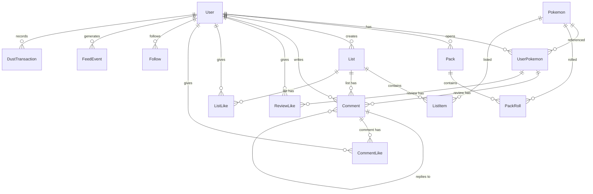
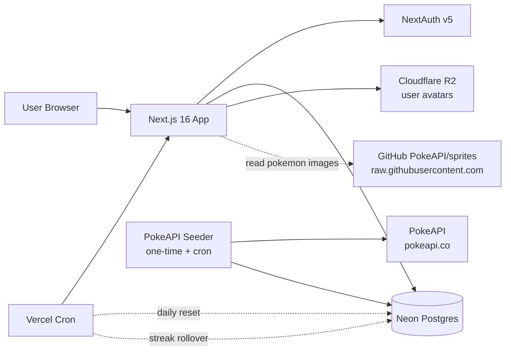

# PokeHub — Project Overview

> **Status:** Planning / pre-MVP
> **Name:** PokeHub
> **Author:** Damian
> **Last updated:** 2026-04-27

---

## 1. Problem statement

Pokémon has one of the strongest fan communities on the internet — but the social experience around it is fragmented:

- **Smogon / Reddit / Discord** — text-heavy, forum-style, high barrier to entry, dated UX.
- **Pokémon HOME / official apps** — collection-only, zero social layer, walled garden.
- **Pokémon TCG Live** — collection + battle, but card-game scope only.
- **Twitter / Instagram / TikTok** — generic platforms; Pokémon content gets buried in algorithmic noise.

There is no equivalent of **Letterboxd-for-Pokémon**: a clean, modern, opinion-first social platform where fans can rate, review, list, and discuss the ~1300 species of the franchise — and where their personal "trainer identity" travels with them across the platform.

PokeHub is that platform, with one twist: a **passive collection layer** (daily packs) overlaid on top of the opinion layer, giving users a daily-return hook without gating any of the core social functionality behind a grind.

### Core thesis

> The opinion layer is **democratic** — every user can rate, review, list, and follow from the first minute.
> The collection layer is **earned** — it's a parallel achievement system that decorates your profile but never gates your voice.

---

## 2. Target users

| Persona           | Description                                                                   | Primary use case                                                                                          |
| ----------------- | ----------------------------------------------------------------------------- | --------------------------------------------------------------------------------------------------------- |
| **The Ranker**    | Has strong opinions about Pokémon since Gen 1. Wants a place to publish them. | Writes reviews, builds top-N lists, follows critics with similar taste.                                   |
| **The Collector** | Loves collection mechanics (TCG, Pokémon HOME, ShinyHunting).                 | Opens daily packs, builds out their Pokédex, trades duplicates (v2).                                      |
| **The Lurker**    | Doesn't post much but loves browsing.                                         | Reads lists, follows favorite creators, lurks the discovery feed.                                         |
| **The Returnee**  | Played Gen 1–3 as a kid, wants nostalgia without re-installing emulators.     | Builds nostalgic teams, rates their childhood favorites, discovers new generations through the community. |

---

## 3. Core mechanics

PokeHub has **two independent axes** of user activity. They share a profile and a data model, but neither gates the other.

### Axis 1 — Opinions (Letterboxd layer)

Available to every user on signup, for every Pokémon, with no unlocks required.

- **Rate** any Pokémon 1–5 stars
- **Review** with optional long-form text
- **Favorite** (heart) any Pokémon — unlimited
- **Wishlist** up to 3 Pokémon (also influences pack drops; see §4.5)
- **Lists** — create ranked or unranked lists ("My Top 10 Water Types", "Underrated Gen 5", "Nostalgic Team")
- **Follow** other users
- **Comment** on reviews and lists
- **Like** reviews, lists, and comments
- **Signature team** — pin 6 Pokémon to your profile as identity expression

### Axis 2 — Collection (Pack layer)

Parallel system that records what a user has "caught" via packs. Cosmetic / progression only.

- **Daily free pack** — 1 per 24 hours, contains 3 Pokémon weighted by rarity
- **Earned packs** — earned via platform activity (caps at 5/day to prevent abuse)
- **Caught flag per Pokémon** — `isCaught: boolean` (set when first pulled from a pack)
- **Duplicates count** — pulling Pikachu twice gives you `Pikachu ×2`
- **Shiny variants** — ~0.5% per slot, independent of tier
- **Dust currency** — duplicates can be dissolved into "dust" (10 per duplicate); 100 dust = bonus pack
- **Pity system** — guaranteed rare after 20 packs without one; guaranteed mythical after 50

### Why two axes (and not one)?

| Single-axis design            | Why it fails                                                                                              |
| ----------------------------- | --------------------------------------------------------------------------------------------------------- |
| Pure opinion (no packs)       | Weak daily-return hook. No reason to come back tomorrow if you've already rated your favorites.           |
| Pure collection (no opinions) | Voices gated by grind. Newcomers can't participate. Becomes Pokémon TCG Live with comments.               |
| Coupled (must catch to rate)  | Worst of both. Lists capped to RNG. Childhood favorites you never roll. Frustration.                      |
| **Decoupled (PokeHub)**       | **Opinions are democratic from minute one. Collection adds a parallel reward loop and a richer profile.** |

---

## 4. Pack mechanics (detailed)

The pack system is the daily-return engine. Every parameter below is tunable post-launch via env/config.

### 4.1 Pack size & rarity tiers

Each pack contains **3 Pokémon**, each rolled independently against the rarity table:

| Tier         | Weight | Source criterion (PokeAPI)                                     |
| ------------ | ------ | -------------------------------------------------------------- |
| `COMMON`     | 70%    | Default                                                        |
| `UNCOMMON`   | 20%    | Pseudo-legendaries, starters, fan favorites (curated tag list) |
| `RARE`       | 9%     | `is_legendary === true` on `pokemon-species`                   |
| `ULTRA_RARE` | 1%     | `is_mythical === true` on `pokemon-species`                    |

**Shiny:** independent ~0.5% roll per slot, applied after tier resolution.

### 4.2 Pack sources

| Source                    | Rate                          | Cooldown             |
| ------------------------- | ----------------------------- | -------------------- |
| `DAILY_FREE`              | 1 / day                       | 24h since last claim |
| `ACTIVITY_REVIEW`         | 1 per first review of the day | Daily reset          |
| `ACTIVITY_LIST`           | 1 per list created            | 1 / day              |
| `ACTIVITY_LIKES_RECEIVED` | 1 per 5 likes earned          | Cap: 1 / day         |
| `STREAK_BONUS`            | 1 every 7-day streak          | At streak rollover   |
| `DUST_PURCHASE`           | 1 per 100 dust                | No cooldown          |

**Hard cap:** 5 earned packs per user per day (excluding daily free + dust purchases). Prevents spam-content gaming the system.

### 4.3 Pity counters

Stored on `User`:

- `packsSinceLastRare` — increments per pack opened. On RARE+ pull, resets. At 20, next pack guarantees a RARE-tier slot.
- `packsSinceLastUltraRare` — same, threshold 50, guarantees ULTRA_RARE.

### 4.4 Duplicates & dust

- Duplicate of a Pokémon you already have → `count` increments on `UserPokemon`.
- User can manually dissolve duplicates: `dissolve(pokemonId)` → +10 dust, `count -= 1`.
- 100 dust → buy 1 pack of type `DUST_PURCHASE` (counts toward earned pack cap).
- Shiny duplicates: separate counter (`shinyCount`), worth 100 dust each on dissolve.

### 4.5 Wishlist boost (soft targeting)

Users select up to 3 wishlist Pokémon. Each wishlisted Pokémon gets ×1.5 weight in _their_ pack rolls (only their own packs — not a global change).

### 4.6 Social feedback on rare pulls

When a roll comes out RARE, ULTRA_RARE, or SHINY, a `FeedEvent` is created that surfaces to followers. Common pulls don't spam the feed.

---

## 5. Data model

### 5.1 ERD



### 5.2 Architecture



### 5.3 Prisma schema (Prisma 7, TypeScript-based query compiler)

```prisma
generator client {
  provider = "prisma-client"
  output   = "../src/generated/prisma"
}

datasource db {
  provider = "postgresql"
  url      = env("DATABASE_URL")
}

// =========================================================
// NextAuth
// =========================================================

model Account {
  id                String  @id @default(cuid())
  userId            String
  type              String
  provider          String
  providerAccountId String
  refresh_token     String? @db.Text
  access_token      String? @db.Text
  expires_at        Int?
  token_type        String?
  scope             String?
  id_token          String? @db.Text
  session_state     String?

  user User @relation(fields: [userId], references: [id], onDelete: Cascade)

  @@unique([provider, providerAccountId])
}

model Session {
  id           String   @id @default(cuid())
  sessionToken String   @unique
  userId       String
  expires      DateTime
  user         User     @relation(fields: [userId], references: [id], onDelete: Cascade)
}

model VerificationToken {
  identifier String
  token      String   @unique
  expires    DateTime

  @@unique([identifier, token])
}

// =========================================================
// User
// =========================================================

model User {
  id            String    @id @default(cuid())
  email         String    @unique
  emailVerified DateTime?
  name          String?
  username      String?   @unique
  image         String?
  bio           String?

  // Credentials auth (nullable — OAuth/magic-link users never set one)
  password      String?   // bcrypt hash, never plaintext

  // Currency & progression
  dust                    Int @default(0)
  packsSinceLastRare      Int @default(0)
  packsSinceLastUltraRare Int @default(0)

  // Streaks
  currentStreak Int       @default(0)
  longestStreak Int       @default(0)
  lastDailyAt   DateTime?

  // Signature team — array of pokemonIds, max length 6 enforced in app
  signatureTeam Int[] @default([])

  // Subscription (cosmetic-only Pro)
  isPro Boolean @default(false)

  // Relations
  accounts         Account[]
  sessions         Session[]
  pokemons         UserPokemon[]
  packs            Pack[]
  lists            List[]
  comments         Comment[]
  reviewLikes      ReviewLike[]
  listLikes        ListLike[]
  commentLikes     CommentLike[]
  followers        Follow[]          @relation("Following")
  following        Follow[]          @relation("Followers")
  feedEvents       FeedEvent[]
  dustTransactions DustTransaction[]

  createdAt DateTime @default(now())
  updatedAt DateTime @updatedAt

  @@index([createdAt])
}

// =========================================================
// Pokemon (seeded from PokeAPI, ~1300 rows)
// =========================================================

enum Rarity {
  COMMON
  UNCOMMON
  RARE
  ULTRA_RARE
}

model Pokemon {
  id          Int    @id // pokedex number
  slug        String @unique
  name        String
  types       String[]
  generation  Int
  isLegendary Boolean @default(false)
  isMythical  Boolean @default(false)
  rarity      Rarity

  // Images (all hosted on raw.githubusercontent.com/PokeAPI/sprites)
  artworkUrl      String  // official-artwork
  spriteUrl       String  // small sprite
  shinyArtworkUrl String?

  // Stats
  height    Int  // decimeters
  weight    Int  // hectograms
  baseStats Json // { hp, attack, defense, spAttack, spDefense, speed }

  flavorText String?

  userPokemons UserPokemon[]
  packRolls    PackRoll[]
  listItems    ListItem[]

  createdAt DateTime @default(now())
  updatedAt DateTime @updatedAt

  @@index([rarity])
  @@index([generation])
  @@index([slug])
  @@index([isLegendary])
  @@index([isMythical])
}

// =========================================================
// UserPokemon — central per-user-per-pokemon state
// Holds collection status + review (one row per pair)
// =========================================================

model UserPokemon {
  id        String @id @default(cuid())
  userId    String
  pokemonId Int

  // Collection
  isCaught      Boolean   @default(false)
  count         Int       @default(0)
  shinyCount    Int       @default(0)
  firstCaughtAt DateTime?

  // Personal flags
  isFavorite Boolean @default(false)
  isWishlist Boolean @default(false)

  // Review (rating + optional text)
  rating     Int?      // 1-5, validated app-side
  reviewText String?
  reviewedAt DateTime?

  user        User         @relation(fields: [userId], references: [id], onDelete: Cascade)
  pokemon     Pokemon      @relation(fields: [pokemonId], references: [id])
  comments    Comment[]    @relation("CommentsOnReview")
  reviewLikes ReviewLike[]

  createdAt DateTime @default(now())
  updatedAt DateTime @updatedAt

  @@unique([userId, pokemonId])
  @@index([userId, isCaught])
  @@index([userId, isFavorite])
  @@index([userId, isWishlist])
  @@index([pokemonId, rating])      // for aggregating community ratings
  @@index([reviewedAt])              // for global review feed
}

// =========================================================
// Packs
// =========================================================

enum PackType {
  DAILY
  EARNED
  PREMIUM
  EVENT
}

enum PackSource {
  DAILY_FREE
  ACTIVITY_REVIEW
  ACTIVITY_LIST
  ACTIVITY_LIKES_RECEIVED
  STREAK_BONUS
  DUST_PURCHASE
  EVENT
}

model Pack {
  id       String     @id @default(cuid())
  userId   String
  type     PackType   @default(DAILY)
  source   PackSource
  openedAt DateTime   @default(now())

  user  User       @relation(fields: [userId], references: [id], onDelete: Cascade)
  rolls PackRoll[]

  @@index([userId, openedAt])
  @@index([source, openedAt])
}

model PackRoll {
  id        String  @id @default(cuid())
  packId    String
  pokemonId Int
  position  Int     // 1, 2, or 3
  isShiny   Boolean @default(false)
  rarity    Rarity  // snapshot at roll time

  pack    Pack    @relation(fields: [packId], references: [id], onDelete: Cascade)
  pokemon Pokemon @relation(fields: [pokemonId], references: [id])

  @@unique([packId, position])
  @@index([packId])
}

// =========================================================
// Lists
// =========================================================

model List {
  id          String  @id @default(cuid())
  userId      String
  title       String
  slug        String
  description String?
  isPublic    Boolean @default(true)
  isRanked    Boolean @default(true)

  user      User       @relation(fields: [userId], references: [id], onDelete: Cascade)
  items     ListItem[]
  comments  Comment[]  @relation("CommentsOnList")
  listLikes ListLike[]

  createdAt DateTime @default(now())
  updatedAt DateTime @updatedAt

  @@unique([userId, slug])
  @@index([userId, createdAt])
  @@index([isPublic, createdAt]) // public discovery feed
}

model ListItem {
  id        String  @id @default(cuid())
  listId    String
  pokemonId Int
  position  Int
  note      String?

  list    List    @relation(fields: [listId], references: [id], onDelete: Cascade)
  pokemon Pokemon @relation(fields: [pokemonId], references: [id])

  @@unique([listId, pokemonId])
  @@unique([listId, position])
  @@index([listId])
}

// =========================================================
// Comments (polymorphic via two nullable FKs)
// CHECK constraint via migration: exactly one of (reviewId, listId) must be set
// =========================================================

model Comment {
  id   String @id @default(cuid())
  userId String
  body String

  // Polymorphic target
  reviewId String? // -> UserPokemon.id
  listId   String? // -> List.id
  parentId String? // for threaded replies

  user     User         @relation(fields: [userId], references: [id], onDelete: Cascade)
  review   UserPokemon? @relation("CommentsOnReview", fields: [reviewId], references: [id], onDelete: Cascade)
  list     List?        @relation("CommentsOnList", fields: [listId], references: [id], onDelete: Cascade)
  parent   Comment?     @relation("CommentReplies", fields: [parentId], references: [id], onDelete: Cascade)
  replies  Comment[]    @relation("CommentReplies")
  likes    CommentLike[]

  createdAt DateTime @default(now())
  updatedAt DateTime @updatedAt

  @@index([reviewId, createdAt])
  @@index([listId, createdAt])
  @@index([parentId])
  @@index([userId, createdAt])
}

// =========================================================
// Likes (separate tables — cleaner than polymorphic in Postgres)
// =========================================================

model ReviewLike {
  userId    String
  reviewId  String
  createdAt DateTime @default(now())

  user   User        @relation(fields: [userId], references: [id], onDelete: Cascade)
  review UserPokemon @relation(fields: [reviewId], references: [id], onDelete: Cascade)

  @@id([userId, reviewId])
  @@index([reviewId])
}

model ListLike {
  userId    String
  listId    String
  createdAt DateTime @default(now())

  user User @relation(fields: [userId], references: [id], onDelete: Cascade)
  list List @relation(fields: [listId], references: [id], onDelete: Cascade)

  @@id([userId, listId])
  @@index([listId])
}

model CommentLike {
  userId    String
  commentId String
  createdAt DateTime @default(now())

  user    User    @relation(fields: [userId], references: [id], onDelete: Cascade)
  comment Comment @relation(fields: [commentId], references: [id], onDelete: Cascade)

  @@id([userId, commentId])
  @@index([commentId])
}

// =========================================================
// Follow graph
// =========================================================

model Follow {
  followerId  String
  followingId String
  createdAt   DateTime @default(now())

  follower  User @relation("Followers", fields: [followerId], references: [id], onDelete: Cascade)
  following User @relation("Following", fields: [followingId], references: [id], onDelete: Cascade)

  @@id([followerId, followingId])
  @@index([followerId])
  @@index([followingId])
}

// =========================================================
// Feed events (activity stream)
// =========================================================

enum FeedEventType {
  REVIEW_CREATED
  LIST_CREATED
  RARE_PULL
  ULTRA_RARE_PULL
  SHINY_PULL
  POKEMON_FAVORITED
  STREAK_MILESTONE
  USER_FOLLOWED
}

model FeedEvent {
  id       String        @id @default(cuid())
  userId   String
  type     FeedEventType
  metadata Json          // flexible payload — pokemonId, listId, packRollId, etc.

  user User @relation(fields: [userId], references: [id], onDelete: Cascade)

  createdAt DateTime @default(now())

  @@index([userId, createdAt])
  @@index([type, createdAt])
}

// =========================================================
// Dust ledger (audit trail of currency)
// =========================================================

enum DustReason {
  DUPLICATE_DISSOLVED
  SHINY_DISSOLVED
  PACK_PURCHASED
  EVENT_REWARD
  STREAK_BONUS
}

model DustTransaction {
  id          String     @id @default(cuid())
  userId      String
  amount      Int        // positive = earned, negative = spent
  reason      DustReason
  referenceId String?    // pokemonId, packId, etc.

  user User @relation(fields: [userId], references: [id], onDelete: Cascade)

  createdAt DateTime @default(now())

  @@index([userId, createdAt])
}
```

### 5.4 Schema notes & decisions

| Decision                                                 | Rationale                                                                                                                                      |
| -------------------------------------------------------- | ---------------------------------------------------------------------------------------------------------------------------------------------- |
| `UserPokemon` holds **both** collection state and review | Avoids two tables for what is logically "user's relationship to this Pokémon". One join, simpler queries.                                      |
| Three separate `*Like` tables vs polymorphic             | Postgres `NULL != NULL` breaks unique constraints on polymorphic likes. Three tables = proper composite keys, no application-side enforcement. |
| `Pokemon.id` is `Int` (pokedex number)                   | Stable, externally meaningful, debugging-friendly. Pokédex numbers don't change.                                                               |
| `Comment` uses polymorphic two-nullable-FK               | Comments need a single table for unified queries (user's all comments). CHECK constraint added via migration.                                  |
| `signatureTeam` as `Int[]` rather than join table        | Always exactly 0–6 items, no metadata per slot, ordered. Array is the right primitive.                                                         |
| `DustTransaction` as ledger                              | Source of truth for user's dust; balance = `SUM(amount)`. Audit trail for free, easy to debug "where did my dust go?".                         |
| `FeedEvent.metadata` as `Json`                           | Flexibility for varied event types without schema migrations per new event. Trade-off: less type safety; document shapes in a TS union.        |
| Rarity stored on both `Pokemon` and `PackRoll`           | Snapshot pattern: if rarity tiers are rebalanced, historical pulls preserve the rarity they were when rolled.                                  |

---

## 6. Routing conventions

```
/                          Landing (logged out) | Feed (logged in)
/login                     OAuth providers + email/password
/signup                    Username selection step

/u/[username]              User profile (signature team, stats, recent activity)
/u/[username]/collection   Collection grid (caught / missing)
/u/[username]/reviews      All reviews
/u/[username]/lists        All public lists
/u/[username]/followers
/u/[username]/following

/p/[slug]                  Pokémon detail (community ratings, top reviews, lists featuring it)
/p/[slug]/reviews          All reviews of this Pokémon

/list/[id]                 List detail with comments
/list/new                  Create list
/list/[id]/edit

/review/[id]               Single review view (deep-link from feed/notifications)

/packs                     Pack opening — daily + earned + dust shop
/packs/history             Past pack contents

/discover                  Trending lists, top reviewers, popular Pokémon
/search                    Unified search (users, Pokémon, lists)

/settings                  Profile, account, notifications
/settings/wishlist         Manage 3 wishlist slots
/settings/signature-team   Configure pinned 6
/settings/billing          Pro subscription (cosmetic-only)

/api/auth/*                NextAuth
/api/packs/open            POST — open a pack
/api/packs/dissolve        POST — dissolve duplicates → dust
/api/pokemon/[id]/rate     PUT — set rating + review
/api/pokemon/[id]/status   PUT — set favorite/wishlist
/api/lists                 GET (own), POST
/api/lists/[id]            GET, PUT, DELETE
/api/lists/[id]/items      POST, PUT (reorder), DELETE
/api/comments              POST
/api/comments/[id]         DELETE
/api/likes/review          POST, DELETE
/api/likes/list            POST, DELETE
/api/likes/comment         POST, DELETE
/api/follows               POST, DELETE
/api/feed                  GET — paginated personal feed
/api/discover/trending     GET — public discovery
```

---

## 7. Tech stack

| Layer        | Choice                             | Notes                                                         |
| ------------ | ---------------------------------- | ------------------------------------------------------------- |
| Framework    | Next.js 16 (App Router)            | RSC for static Pokémon pages, route handlers for mutations    |
| UI           | React 19 + Tailwind v4 + shadcn/ui | Same design system                                            |
| ORM          | Prisma 7 (Rust-free client)        | TypeScript query compiler, smaller bundle, edge-friendly      |
| DB           | Neon Postgres                      | Branching for preview deploys                                 |
| Auth         | NextAuth v5                        | OAuth (Google, GitHub) + email magic link + email/password    |
| File storage | Cloudflare R2                      | User avatars only (Pokémon images via PokeAPI sprites GitHub) |
| Payments     | Stripe                             | Pro subscription (cosmetic-only)                              |
| Cron         | Vercel Cron                        | Daily reset, streak rollover, weekly digest                   |
| Hosting      | Vercel                             | Edge-friendly with Prisma 7                                   |
| External     | PokeAPI                            | One-time seed + monthly sync                                  |

---

## 8. Pokémon data strategy

PokeAPI is a free public API serving ~50B requests/month. We don't hit it at runtime.

### 8.1 Seeding

A standalone script (`scripts/seed-pokemon.ts`) runs once at project setup and on demand thereafter:

1. Fetch `/api/v2/pokemon-species?limit=10000` → list of all species
2. For each: fetch `/pokemon/{id}` and `/pokemon-species/{id}`
3. Map to `Pokemon` rows; compute `rarity` from `is_legendary` / `is_mythical` + curated uncommon list
4. Image URLs point to `https://raw.githubusercontent.com/PokeAPI/sprites/master/...` — no proxying
5. Insert via `prisma.pokemon.createMany({ skipDuplicates: true })`

Re-runnable safely (idempotent).

### 8.2 Why GitHub sprites and not R2?

- PokeAPI explicitly hosts these for public use; no bandwidth cost, no copyright proxy concern
- Next.js Image component can still optimize them via `remotePatterns`

---

## 9. Free vs Pro

**Pro is cosmetic-only.** No pay-to-win, no gated content, no faster pity, no better odds.

| Feature                    | Free          | Pro                                    |
| -------------------------- | ------------- | -------------------------------------- |
| Daily pack                 | ✅            | ✅                                     |
| Earnable packs (cap 5/day) | ✅            | ✅                                     |
| Pack odds                  | Standard      | **Standard (no change)**               |
| Reviews & ratings          | Unlimited     | Unlimited                              |
| Lists                      | 20 max        | Unlimited                              |
| Wishlist slots             | 3             | 5                                      |
| Signature team             | 6 fixed slots | 6 with custom backgrounds              |
| Profile customization      | Default theme | Custom themes, animated avatars        |
| Pack opening animation     | Standard      | Premium animations + sound             |
| Profile badges             | Earned only   | Earned + Pro-exclusive cosmetic badges |
| Ad-free                    | ✅ (always)   | ✅                                     |
| Pricing                    | $0            | $3.99/mo or $29.99/year                |

---

## 10. Development notes

### 10.1 Migration strategy

- Initial migration ships full schema (no incremental dev migrations in commit history)
- Future migrations: feature-flagged, deployed before code that uses them
- Rollback plan documented per migration in `prisma/migrations/README.md`

### 10.2 `DEV_UNLOCK_ALL` feature flag pattern

Set `DEV_UNLOCK_ALL=true` in `.env.local` to bypass daily pack cooldowns, earned pack cap, Pro features, NextAuth, and Stripe checks. Hard-coded `process.env.NODE_ENV !== "production"` guard prevents accidental deploy. See `src/lib/dev.ts`.

### 10.3 Pack opening flow

Single Prisma transaction: validate eligibility → roll 3 slots (tier + shiny) → persist Pack + PackRolls → upsert UserPokemon (isCaught, count, shinyCount) → update pity counters + lastDailyAt → emit FeedEvents for RARE/ULTRA_RARE/SHINY pulls. Atomic — no half-opened packs.

### 10.4 Seeding & maintenance

| Job             | Schedule             | Action                            |
| --------------- | -------------------- | --------------------------------- |
| Pokémon seed    | One-time + on-demand | Full PokeAPI sync                 |
| Daily reset     | `0 0 * * *` UTC      | Reset earned-pack daily counters  |
| Streak rollover | `0 0 * * *` UTC      | Increment / break streaks         |
| Weekly digest   | `0 9 * * MON` UTC    | Email top community lists/reviews |
| FeedEvent prune | `0 3 * * SUN`        | Delete events older than 90 days  |

---

## 11. What this project demonstrates (for portfolio)

Targeted at mid-level JS/React positions in the Polish market.

| Skill                              | Where it shows up                                                                                                              |
| ---------------------------------- | ------------------------------------------------------------------------------------------------------------------------------ |
| **Next.js 16 / React 19 / RSC**    | Full app in App Router, server components for static Pokémon pages, server actions for mutations                               |
| **TypeScript at production depth** | End-to-end typing, Prisma-generated types, Zod validation at API boundaries                                                    |
| **Database design**                | 14-model schema with thoughtful indexing, composite keys, polymorphic patterns, ledger pattern for currency                    |
| **System design**                  | Decoupled axes architecture, ledger-based currency, pity counters, transaction-wrapped pack opens, snapshot pattern for rarity |
| **External API integration**       | PokeAPI seeding strategy, image hosting decision (link vs proxy), one-shot vs continuous sync                                  |
| **Game design / mechanics**        | Rarity weighting, pity systems, soft-targeting via wishlist, dust economy with sources & sinks, pay-to-win avoidance           |
| **Auth & subscription**            | NextAuth v5 OAuth + magic link, Stripe webhook handling, feature flag (`isPro` + cosmetic-only enforcement)                    |
| **State management**               | TanStack Query for server state, Zustand for ephemeral UI                                                                      |
| **Testing**                        | Vitest unit (rarity weights, pity logic), Playwright e2e (pack open → collection update)                                       |
| **Performance**                    | Indexes for hot paths, pagination patterns, Next.js image optimization, edge-friendly Prisma 7                                 |

**Talking points for interviews:**

1. _"How did you design the dual-axis system?"_ → Walk through why opinion + collection are decoupled.
2. _"How does pack opening stay consistent under concurrent requests?"_ → Single transaction, pity counters as user-row fields (no race), idempotent UserPokemon upsert.
3. _"Why three Like tables instead of one?"_ → Postgres NULL semantics on unique constraints.
4. _"Why is rarity stored on PackRoll if it's also on Pokemon?"_ → Snapshot pattern for rebalances.
5. _"How would you scale this?"_ → Read replicas for the discovery feed, Redis for pity counters if write-heavy, archival for old FeedEvents (already pruning).

---

## 12. Open questions / future considerations

These are intentionally **not in v1**. Listed so future-Damian doesn't paint into a corner.

- **Trading.** Schema already supports duplicates (`count`). Trading needs: trade proposal, two-party confirmation, anti-abuse (cooldowns, value matching). Consider for v2.
- **Battles.** Pokémon Showdown integration. Big scope. Probably v3+ or never.
- **Mobile app.** React Native sharing 80% of the logic. v2 candidate.
- **Themed packs.** Schema's `Pack.type` already allows `EVENT`. Halloween (Ghost types), Anniversary (Gen 1), etc.
- **Notifications.** New comment on your review, new follower, etc. Simple `Notification` model + WebSocket or polling.
- **Search.** Postgres FTS for v1, Algolia/Meilisearch if it grows.
- **Moderation.** Reports, mute/block, mod tools. Critical before any public launch.
- **Localization.** Polish + English at minimum. PokéAPI provides flavor text in many languages.

---

## 13. Legal & IP note

Pokémon is a trademark of Nintendo, Game Freak, and The Pokémon Company. PokeHub is a fan-built portfolio project demonstrating engineering skills.

- **No commercial deployment** without licensing review
- **PokeAPI data is public**, but Pokémon imagery and names are trademarked
- For production launch (if ever): rebrand or reach out to TPC about fan project guidelines

---

## 14. Key design decisions

### Schema

- **`UserPokemon` combines collection state and review.** One row per user×pokemon covers both axes — splitting forces a join on every profile read for zero gain.
- **Three separate `*Like` tables.** Postgres `NULL != NULL` breaks `@@unique` on polymorphic patterns; three tight tables give proper composite PKs without workarounds.
- **`Comment` uses polymorphic two-nullable-FK + CHECK constraint.** Needed for unified "all comments by user X" queries; application invariant (exactly one of `reviewId`/`listId` set) enforced in the migration.
- **`isCaught` is boolean, not enum.** No mechanic produces a "SEEN" state — enum value with no write path is dead code. Boolean → enum migration is trivial if passive discovery is added later.
- **Rarity snapshotted on `PackRoll`.** If rarity tiers are rebalanced, historical pulls preserve the rarity they were rolled at.
- **`Pokemon.id` is the Pokédex number.** Stable, externally meaningful, makes URLs readable (`/p/25`).
- **`signatureTeam` as `Int[]`.** Always 0–6 items, ordered, no per-slot metadata — Postgres array is the right primitive.
- **`DustTransaction` as ledger.** Balance = `SUM(amount)`; append-only gives free audit trail and concurrency safety.
- **`FeedEvent.metadata` as `Json`.** Different event types carry different payloads; flexibility outweighs weaker DB-level type safety (mitigated by Zod at write time).

### Mechanics

- **Two decoupled axes.** Coupling opinion + collection gates voices behind grind and breaks lists ("Top 10 Water Types" capped to RNG). Decoupling preserves Letterboxd's value proposition while adding a parallel reward loop.
- **Pro tier is strictly cosmetic.** The moment Pro affects pack odds or content, the trust contract breaks. Letterboxd Pro is the model.
- **Dust economy in v1.** Ledger pattern + currency sources/sinks demonstrates real system design depth; significant portfolio value for ~2–3 days of scope.
- **Streaks in v1.** Cost: one cron job + ~30 lines. Benefit: strong retention hook (Duolingo effect) + `STREAK_BONUS` pack source feeds the economy.
- **Pity thresholds 20 (rare) / 50 (ultra rare).** Tunable post-launch. At daily-only cadence: ~3 weeks worst-case for a rare, ~7 weeks for a mythical.
- **Wishlist boost ×1.5 on 3 selected Pokémon.** Soft targeting — doesn't change rarity tiers, only nudges _which_ Pokémon within a tier you're more likely to roll.
- **Hard cap of 5 earned packs/day.** Prevents content-spam gaming; floor (1 daily) and ceiling (1 + 5 earned + dust purchases) are predictable.

### Routing & auth

- **Username required at signup, used in URLs.** Critical for shareability (`/u/damian`). Nullable in schema because OAuth creates a User before the handle is chosen; middleware redirects `username === null` users to `/signup/username`.
- **No explicit `@@index([username])`.** `@unique` already creates a B-tree index in Postgres — the extra declaration would be redundant.
- **OAuth + magic link + email/password.** Not every user wants to link Google/GitHub or wait on a magic-link email. `User.password` stores a bcrypt hash and is nullable — OAuth/magic-link users never set one.

---

## 15. UI design prototype

A high-fidelity UI prototype exists in Claude Design, covering both the logged-in app and the logged-out landing page.

### 15.1 Location

- Project: "PokeHub UI Prototype" — https://claude.ai/design/p/0c1d47b5-6b08-4235-a5b5-cb2849651a1d
- Files: `PokeHub.dc.html` (logged-in app — Feed / Profile / Pokémon Detail / Packs), `PokeHub-Landing.dc.html` (logged-out marketing/landing page)
- Re-fetch via the `claude_design` MCP connector rather than relying on a cached summary when implementing a screen.

### 15.2 Visual language

- Dark theme: `#0c0e12` background, `#15181e` card surface, text `#e8eaed` / `#9aa0ab` / `#7b818c`
- Brand gradient: `linear-gradient(135deg, #ff7a45, #c44fe0)` (orange → magenta)
- Typography: Space Grotesk (headings, numerics, stats) + Hanken Grotesk (body)
- Per-type color map for Pokémon type badges; gold (`#e6b450`) for star ratings; gold→pink shimmer for shiny pulls
- Consistently large border radius (11–22px), soft card aesthetic

### 15.3 Screens covered

- **Feed** — review / list / pull activity cards, filter chips (All / Reviews / Lists / Pulls), "who to follow" + trending sidebar
- **Profile** — signature team grid, stats row, favorite-types chart, recent activity
- **Pokémon Detail** — hero artwork, community rating distribution, base stats chart, top reviews, lists featuring this Pokémon
- **Packs** — pack-opening animation (staggered reveal), pity tracker, dust shop
- **Landing** (logged out) — hero, auto-scrolling marquee, features grid, trending grid, testimonials, pack tease, login/signup modal

### 15.4 Known discrepancies vs. this spec (unresolved)

| Area | Design prototype | This spec |
| --- | --- | --- |
| Shiny odds | 1/4096 (classic mainline rate), with its own 200-pack shiny-pity counter | Flat 0.5% per slot (§4.1), no shiny-pity field in schema (§4.3) |
| Dust shop | Sells a "Shiny Charm" (+50% shiny odds for 7 days, ◆4,000) | §9/§14: Pro/economy is strictly cosmetic, no odds boosts of any kind |
| Nav label | "Browse" tab for Pokémon listing | §6: route documented as `/discover` |
| Feed filters | Explicit "Pulls" filter chip alongside Reviews/Lists | Consistent with FeedEvent design (§4.6), but more prominent in the UI than documented |
| Marketing copy | Landing page footer links to "Blog" and "API" | Neither product is in scope (not listed in §12 open questions) |

> **Resolved:** the auth-UI discrepancy (design's email/password modal vs. an earlier OAuth-only spec) was resolved in favor of the design — §14 now documents email/password as a supported auth method alongside OAuth + magic link, and `User.password` was added to the schema.
